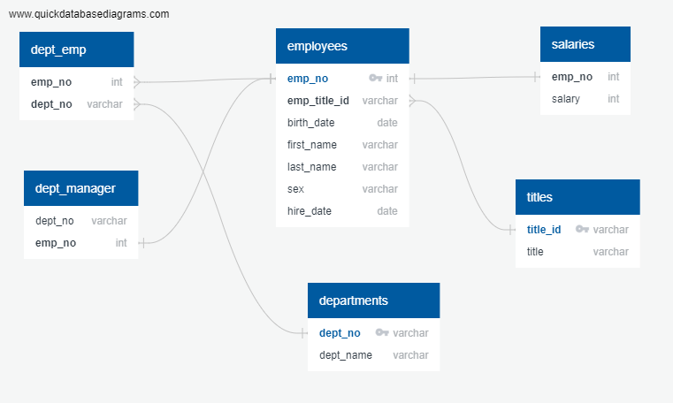

# Unit 8 | SQL Homework - Employee Database: A Mystery in Two Parts
#### _Submitted November 26, 2020_
#### _By: Jim Tran_

### Data Modeling

The use of Quick Database Diagram (QuickDBD) to map out the various csv raw data files to convert to data tables was quick and very helpful.

### Data Engineering

The ERD diagram identifies the primary key, foreign key and data types of each field; and shows the data linkages between each of the csv data files.

1. employees
    * emp_no int PK
    * emp_title_id varchar FK >- titles.title_id
    * birth_date date
    * first_name varchar
    * last_name varchar
    * sex varchar
    * hire_date date

2. salaries
    * emp_no int FK - employees.emp_no
    * salary int

3. dept_emp
    * emp_no int FK >- employees.emp_no
    * dept_no varchar FK >- departments.dept_no

4. dept_manager
    * dept_no varchar
    * emp_no int FK - employees.emp_no

5. departments
    * dept_no varchar PK
    * dept_name varchar

6. titles
    * title_id varchar PK
    * title varchar

The diagram is then used to convert the files into tables in the EMPLOYEES_DB in Postgres pgAdmin. Additionally, the tables were generated from QuickDBD diagrams
to a tables [schemata](03-Tables_Schemata.sql).

### Data Analysis

Once the tables were created and data imported to the EMPLOYEES_DB in Postgres pgAdmin.  The database was used to generate the [Main_Query](04-Main_Query.sql) to answer
the following questions:

1. List the following details of each employee: employee number, last name, first name, sex, and salary.

2. List first name, last name, and hire date for employees who were hired in 1986.

3. List the manager of each department with the following information: department number, department name, the manager's employee number, last name, first name.

4. List the department of each employee with the following information: employee number, last name, first name, and department name.

5. List first name, last name, and sex for employees whose first name is "Hercules" and last names begin with "B."

6. List all employees in the Sales department, including their employee number, last name, first name, and department name.

7. List all employees in the Sales and Development departments, including their employee number, last name, first name, and department name.

8. In descending order, list the frequency count of employee last names, i.e., how many employees share each last name.

### Bonus (Observations)

Lastly, the SQL database was imported into Pandas in the [Bonus_db](05-Bonus_db.ipynb) to generate vizualizations of the spurious data.
The data shows that the majority of employees earned [salaries](Common_Salaries.png) in the $40,000 to $50,000 range but most noteable is that salaries in the $40,000 range was incremental by 1 dollar.
Another interesting point is that average salaries by employee titles show Staff and Senior Staff have high average salaries than all other employees.  Also, all Engineers regardless of level earned about the same average salary of about $48,500.  Not sure what is a Technique Leader but the average salary is $48,582. 

### Epilogue

Employee ID number 499942 reveals... 

#### APRIL FOOLS DAY!!

## Copyright

Data Boot Camp © 2018. All Rights Reserved.
